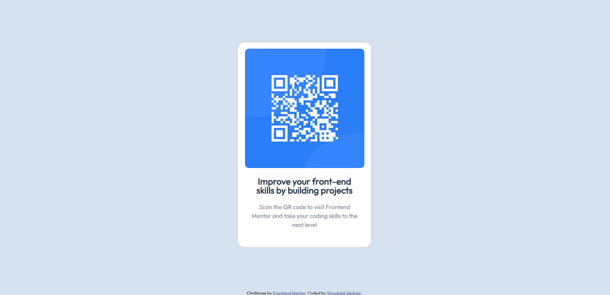

# Frontend Mentor - QR code component solution

This is a solution to the [QR code component challenge on Frontend Mentor](https://www.frontendmentor.io/challenges/qr-code-component-iux_sIO_H). Frontend Mentor challenges help you improve your coding skills by building realistic projects. 

## Table of contents

- [Overview](#overview)
  - [Screenshot](#screenshot)
  - [Links](#links)
- [My process](#my-process)
  - [Built with](#built-with)
  - [Continued development](#continued-development)
  - [Useful resources](#useful-resources)
- [Author](#author)

## Overview

### Screenshot

- Solution URL: [Add solution URL here](https://your-solution-url.com)
- Live Site URL: (https://stately-cobbler-4862ea.netlify.app/)

## My process

### Built with

- Semantic HTML5 markup
- Flexbox

### Continued development
Responsive web design

### Useful resources

- [W3schools](https://www.w3schools.com/) - This helped me when i forgot how to use certain stuff.

## Author

- Frontend Mentor - [@wundaab](https://www.frontendmentor.io/profile/wundaab)
